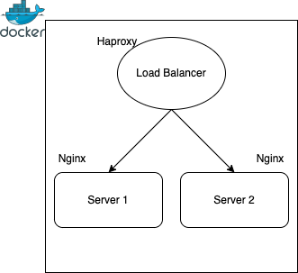

# Dummy Load balancer 

This is a dummy load balancer based on haproxy running two nginx instances based on docker

## Architecture



## Prerequisites

If not already done, [install Docker Compose](https://docs.docker.com/compose/install/)

## How to launch 

```
docker-compose up
```

You can test your dummy load balancer with a forced refresh of your browser on 'http://localhost:80'.  
You can check your haproxy status page with 'http://localhost:80/stats'  

## How to stop 

```
docker-compose down
```

## Clean your env after this dummy test

```
./resources/script/clean.sh
```
